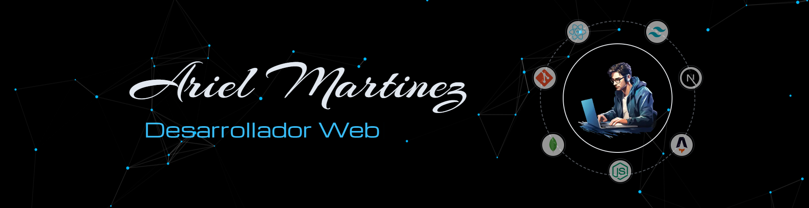

<h1 align="left">Hey 👋 How are you?</h1>

###

Hi, I'm Ariel, I live in Argentina (CABA).

###

<h2 align="left">😎 About me</h2>

###

I am a web developer. As a frontend developer I like React.js to make both web pages and desktop applications. I like to learn new technologies and collaborate in different projects.

###

<h2 align="left">💻 My tech stack</h2>

###

  
  
  
  
  
  
  
  
  
  
  
  
  
  
  
  
  
  
  
  
  
  
  
  
  
  
  
  
  
  
  
  
  
  
  
  
  

###

<h2 align="left">📧 Contact me</h2>

###

  
  

###

<h2 align="left">🌐 Visit my portfolio</h2>

###

<a href="https://portfolio.empren.dev" align="left">https://portfolio.empren.dev</a>

###

